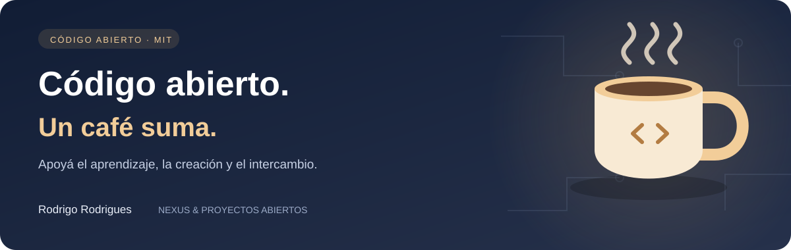

<p align="right">
  <a href="README.md"></a>
  <a href="README.en-US.md"></a>
  <a href="README.es-AR.md"></a>
</p>

# avisar

Diálogos de aviso, confirmación y entrada de texto con Promises, cola de solicitudes y el elemento HTML nativo dialog.

## Empezá acá

Necesitás Git y Node.js 22+ para las pruebas. Sin dependencias de ejecución. Descargá este repositorio; no instales un paquete homónimo sin verificar del registro npm.

```sh
git clone https://github.com/Rdraim/avisar.git
cd avisar
npm test
node tools/check-public-content.mjs
```

Las importaciones del ejemplo funcionan desde la raíz del repositorio clonado. Para usar el módulo en otro proyecto, fijá una revisión Git (tag v1.2.1) o copiá el módulo conservando la licencia MIT. Esta documentación no afirma que exista una publicación en el registro npm.

```js
import { avisar, confirmar, perguntar } from './src/index.js';
await avisar('Guardado.', { titulo: 'Aviso', tema: 'claro' });
const accepted = await confirmar({ texto: '¿Continuar?', cancelar: 'Cancelar', confirmar: 'Continuar' });
const name = await perguntar({ titulo: 'Nombre', texto: 'Ingresá un nombre', valor: '', cancelar: 'Cancelar' });
```

## API

`avisar(texto, opcoes)` → Promise<void>; `confirmar(texto | opcoes)` → Promise<boolean>; `perguntar(texto | opcoes)` → Promise<string | null>; `CSS`.

Los nombres públicos de funciones y opciones se mantienen en portugués por compatibilidad.

## Comportamiento y límites

Opciones: `titulo`, `texto`, `valor`, `confirmar`, `cancelar`, `perigo`, `tema` (auto/claro/escuro), `minimizar`, `rotuloCampo`, `nonce`, `injetarCSS`. Requiere un navegador moderno con `dialog.showModal`. Se puede importar en SSR, pero interactuar sin DOM rechaza la Promise. Escape/X cancelan, Enter envía el formulario y el modal nativo mantiene el foco de Tab. Minimizar conserva el texto y libera la página hasta restaurar; la Promise sigue pendiente. Usa `textContent`. Con CSP estricta, usá un nonce o CSS externo con `injetarCSS: false`; se exporta `CSS`. Personalizá las etiquetas para tu idioma. Demo: `examples/index.html`.

## Seguridad y compatibilidad

Modal nativo, cola, nombres accesibles, temas y minimizar/restaurar conservando los campos.

## Uso práctico — 1.2.0

Las funciones aceptan `signal: AbortSignal`. Cancelar devuelve `null` en `perguntar`, `false` en `confirmar` y `undefined` en `avisar`, incluso en diálogos minimizados o en cola. Usá AbortController cuando se desmonte una página.

Demo para navegador: `examples/index.html`.

## Mantenimiento

Estos módulos independientes se inspiran en problemas resueltos en Nexus, proyecto de Rodrigo Rodrigues. No incluyen bases privadas, configuración de despliegue, logs, credenciales ni registros de usuarios. El mantenimiento coordinado consiste en revisar cambios relacionados en el mismo ciclo; no copia automáticamente archivos privados.

[Cómo contribuir](CONTRIBUTING.es-AR.md) · [Seguridad](SECURITY.es-AR.md)

MIT © Rodrigo Rodrigues

---

<p align="center">
  
</p>

## ☕ Invitame un café

¿Este proyecto te ayudó a resolver un problema, aprender algo nuevo o dar tus primeros pasos en desarrollo? Si querés apoyar mi trabajo, un café es una linda forma de agradecer.

Soy **Rodrigo Rodrigues**, creador de **Nexus** y de estos proyectos de código abierto. Tu aporte me ayuda a dedicar tiempo a mejorar el código, escribir ejemplos más claros y seguir compartiendo lo que aprendo.

**Aportá el monto que tenga sentido para vos. El apoyo es totalmente voluntario; el proyecto sigue siendo gratuito bajo la licencia MIT.**

[Apoyá con Pix](#apoyá-con-pix) · [Dejá un comentario](https://github.com/Rdraim/avisar/issues/new?title=Comentario%3A%20este%20proyecto%20me%20ayud%C3%B3)

### Apoyá con Pix

En la app de tu banco, escaneá el QR o copiá la clave Pix de abajo. Elegí el monto y revisá los datos del destinatario antes de confirmar.

<p align="center">
  
</p>

**Clave Pix**

```text
8875a24e-44d1-4c91-b6bb-62c9f0070955
```

Pix es el sistema de pagos de Brasil. Si tu banco no lo admite, también podés ayudar compartiendo el proyecto, reportando un problema, mejorando la documentación o dejando un comentario.

### Tu comentario también suma

[Contame cómo te ayudó el proyecto](https://github.com/Rdraim/avisar/issues/new?title=Comentario%3A%20este%20proyecto%20me%20ayud%C3%B3). Me gustaría saber qué creaste, qué aprendiste y qué podría ser más claro para quienes recién empiezan.

Los comentarios son bienvenidos con o sin donación. Cuidá tu privacidad: no publiques comprobantes de pago, datos personales, credenciales ni información privada de usuarios en las Issues.

**Gracias por apoyar mi trabajo y ayudarme a seguir creando y compartiendo. ❤️**
